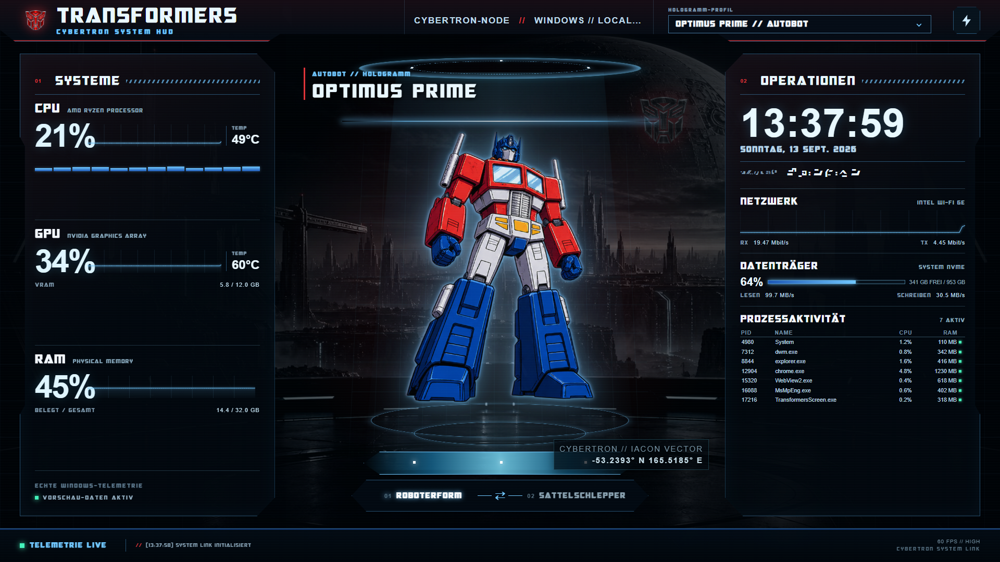

# Transformers Screensaver

A standalone Windows screensaver in a Cybertron-inspired style. Animated Transformer holograms are combined with real system and PC telemetry in a futuristic HUD.



> The screenshot uses the built-in preview/sample data. The installed screensaver can display telemetry from your own Windows PC instead.

## Features

- Comic-only presentation using local robot and alternate-mode assets
- Robot and alternate forms for every Transformer
- Automatic switching between robot and alternate forms
- Fixed Transformer profiles or automatic profile cycling
- Individual HUD colors matched to each Transformer
- Bundled Cybertron-style fonts for headings and visual accents
- Energon Alert and Decepticon attack events
- Live CPU, GPU, temperature, RAM, network, storage, and process data
- Time, date, Windows version, hostname, and system uptime
- Target-monitor selection and multi-monitor support
- Local assets and an offline-capable interface
- Support for the Windows screensaver modes `/s`, `/c`, and `/p`

## Transformers

- Optimus Prime
- Bumblebee
- Grimlock
- Hound
- Megatron
- Shockwave
- Ironhide
- Jazz
- Soundwave

## Installation

1. Download the latest ZIP from [Releases](https://github.com/x4rinia/Transformers_Screensaver/releases) and extract it completely.
2. Run `Install-Screensaver.bat` as administrator.
3. Select and configure the screensaver in the Windows screensaver settings.

Run `Uninstall-Screensaver.bat` to remove it.

## Build from source

Windows 10 or 11 and the .NET 8 SDK are required.

```powershell
dotnet build
```

```powershell
powershell -ExecutionPolicy Bypass -File .\build-release.ps1
```

The release script creates the complete Windows payload, `Transformers.scr`, and the installation and uninstallation scripts in the local `release` directory.
