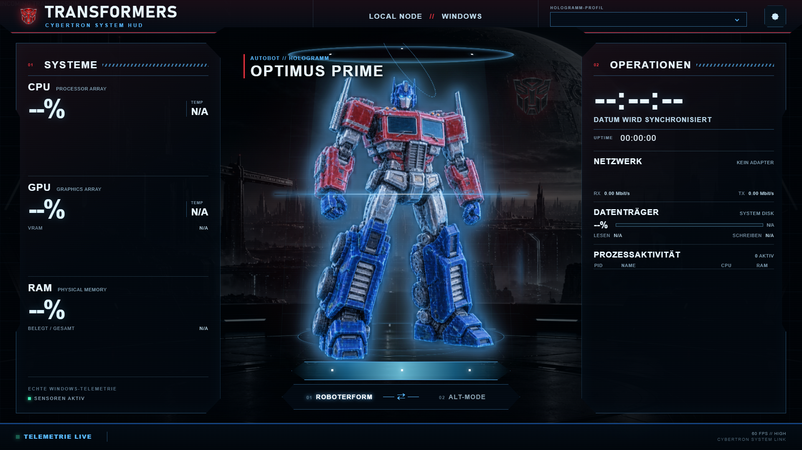

# Transformers Screensaver



A standalone Windows screensaver in a Cybertron / Transformers style. The Transformers serve exclusively as a holographic theme; the main content consists of real Windows and hardware telemetry data.

## Features

- Real telemetry for CPU, CPU Cores, GPU, Temperatures, VRAM, RAM, Network, Disks, and active processes
- Hostname (Custom Name), Windows Version, Date, Time, and System Uptime
- Four data-driven profiles with bot-specific color palettes and faction logos:
  - Optimus Prime — Autobot — Robot / Truck
  - Bumblebee — Autobot — Robot / Sports Car
  - Grimlock — Autobot — Robot / T-Rex
  - Megatron — Decepticon — Robot / Cybertron Tank
- Smooth automatic transitions between Robot and Alt-Mode
- Choose a fixed Transformer or loop through all profiles automatically
- Target monitor selection: Display on Monitor 1, 2, or 3, or all monitors; unselected displays remain black
- Supports Windows Screensaver modes `/s`, `/c`, and `/p`
- Primary and multi-monitor support
- Independent settings storage located at `%LOCALAPPDATA%\TransformersScreen`
- Standalone installer, payload folder, and `.scr` launcher

## Project Structure

- `src/F4rbfieberTransformersScreen` — WPF host, telemetry, and WebView2 HUD
- `src/F4rbfieberTransformersScreen.Launcher` — Lightweight `.scr` launcher
- `src/F4rbfieberTransformersScreen/Web/js/profiles.js` — Central profiles and color schemes
- `build-release.ps1` — Reproducible release / installer build

New Transformers can be added exclusively as another profile in `profiles.js`, as a selection in the configuration window, and with two image assets.

## Running and Building

```powershell
dotnet run --project .\src\F4rbfieberTransformersScreen\F4rbfieberTransformersScreen.csproj
```

```powershell
.\build-release.ps1
```

The release build generates `release\Transformers_SCR`, `Install-Screensaver.bat`, and `Uninstall-Screensaver.bat`. Windows displays the screensaver as `Transformers.scr`.

## Image Sources

The Cybertron environment, holograms, and emblems were specifically generated for this standalone project. The UI, values, and control elements are code-native and not a static screenshot interface.
